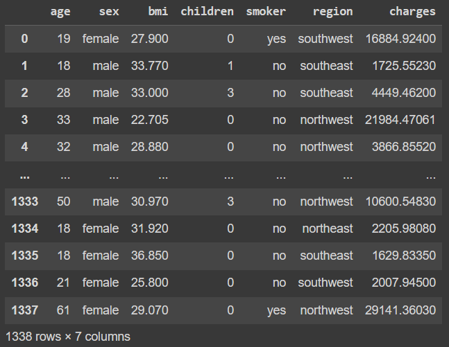
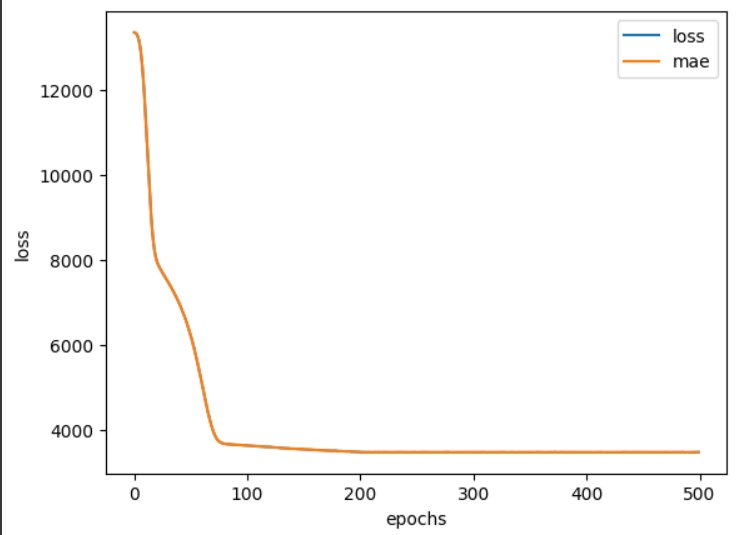

# Modelo de Previsão de Custos de Seguro Médico

Este documento contém um guia detalhado e explicativo para o código Python apresentado, que é um exemplo de construção e treinamento de um modelo de aprendizado de máquina para prever os custos de seguro médico com a ajuda do TensorFlow e outras bibliotecas relevantes. O código é dividido em várias etapas, e este README fornecerá uma visão geral e descrição de cada parte do código.

## Sumário
- Introdução
- Carregamento de Dados
- Pré-processamento de Dados
  - Normalização de Colunas
  - Divisão em Conjuntos de Treinamento e Teste
- Construção do Modelo
- Treinamento do Modelo
- Avaliação do Modelo
- Visualização de Métricas de Treinamento
- Previsões e Comparação com Dados Reais
- Salvando o Modelo Treinado

## 1. Introdução
- O código apresentado é um exemplo de construção de um modelo de aprendizado de máquina usando TensorFlow para prever os custos de seguro médico. O objetivo é treinar um modelo que possa fazer previsões precisas dos custos com base em características como idade, IMC, número de filhos, sexo, se a pessoa é fumante e a região onde reside.

## 2. Carregamento de Dados
- Nesta parte do código, os dados de seguro médico são carregados de um arquivo CSV hospedado online no GitHub. A biblioteca pandas é usada para carregar e exibir os dados.

## 3. Pré-processamento de Dados
- Nesta seção, os dados são pré-processados para prepará-los para o treinamento do modelo. O pré-processamento inclui duas etapas principais:

- Normalização de Colunas: As colunas 'age', 'bmi' e 'children' são normalizadas usando o MinMaxScaler do Scikit-Learn. Isso é importante para garantir que todas as características tenham a mesma escala.

- Codificação One-Hot: As colunas categóricas 'sex', 'smoker' e 'region' são codificadas usando o OneHotEncoder do Scikit-Learn. Isso é necessário porque as redes neurais não podem lidar diretamente com valores categóricos.

## 4. Construção do Modelo
- Nesta etapa, o modelo de aprendizado profundo é construído usando a biblioteca TensorFlow. O modelo é uma sequência de camadas densas (fully connected) e consiste em três camadas:
  - Uma camada oculta com 100 neurônios.
  - Uma camada oculta com 10 neurônios.
  - Uma camada de saída com 1 neurônio (pois estamos prevendo um valor contínuo).
## 5. Treinamento do Modelo
- Nesta parte, o modelo é compilado e treinado com os dados de treinamento. O modelo é configurado para minimizar a função de perda (loss) usando o otimizador Adam. O treinamento é realizado por 500 épocas.

## 6. Avaliação do Modelo
- Após o treinamento, o modelo é avaliado usando os dados de teste e é calculada a métrica de erro médio absoluto (MAE).

## 7. Visualização de Métricas de Treinamento
- A evolução do erro de treinamento ao longo das épocas é visualizada em um gráfico, com o eixo y representando o valor da função de perda (loss) e o eixo x representando o número de épocas.

## 8. Previsões e Comparação com Dados Reais
- O modelo treinado é usado para fazer previsões com base nos dados de teste e as previsões são comparadas com os valores reais para avaliar o desempenho do modelo.

9. Salvando o Modelo Treinado
Por fim, o modelo treinado é salvo em um arquivo chamado "Modelo_Previsao_Medicamentos.h5" para uso futuro.

Este código fornece um exemplo completo de como construir, treinar e avaliar um modelo de aprendizado de máquina para previsão de custos de seguro médico. É importante notar que este é apenas um exemplo e que aprimoramentos e otimizações podem ser feitos para alcançar melhores resultados em cenários do mundo real.
